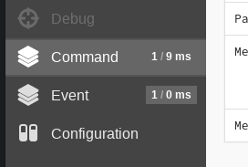
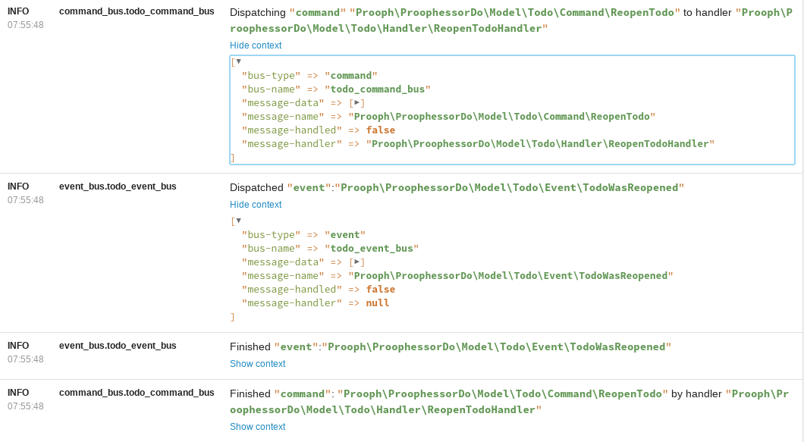

# Symfony Profiler

The ProophServiceBusBundle provides several plugins that help you to inspect your application.
For most of them you will need access to the Symfony Profiler, so please ensure that you have installed the
[WebProfilerBundle](https://packagist.org/packages/symfony/web-profiler-bundle).

## DataCollectorPlugin

The DataCollectorPlugin gathers data about the dispatched messages and shows them in an extra section within
the Symfony Profiler.
There is one profiler for the command- and one for the event-buses
and both are automatically enabled if `kernel.debug` is `true`.

## PsrLoggerPlugin

The PsrLoggerPlugin fills your log with information about your dispatched messages.
There will be one PsrLoggerPlugin automatically registered for each defined message bus.

You can find the logged messages either in the *Logs* section of the Symfony Profiler or directly in your log
(depending on how your logging is configured).

## StopwatchPlugin

The StopwatchPlugin is automatically enabled if `kernel.debug` is `true`
(which is the case e.g. in the `dev` environment).
It times the execution time of your command- and event-handlers.
The collected data are shown within the *Performance* section of the Symfony Profiler.

For an example with a executed command and an executed event please have a look at the following image:

